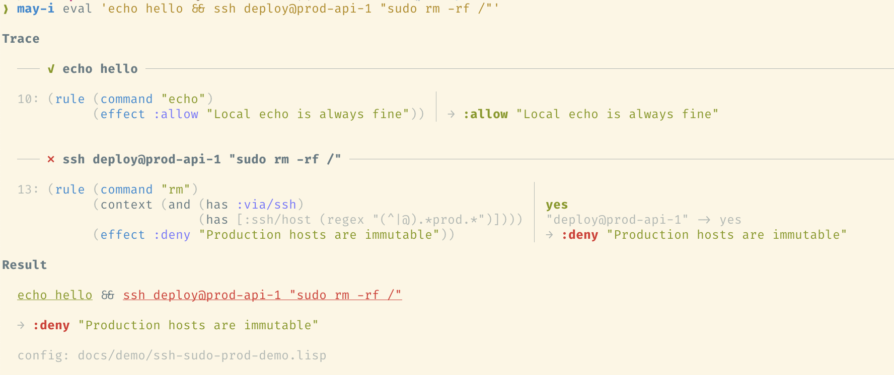

# may-i

`may-i` is a permissions check system for agents that can call shell commands
via tools. You write expressive rules describing what's safe for your agents to
run without prompting you, and block them from executing the really bad stuff.

The goal is giving you the convenience of `--dangerously-skip-permissions`, but
with way more safety.

Here you can see `may-i` in action: we have a config that defines prod servers
as 'immutable', and a dodgy command that breaks the rules is blocked.



<details>
<summary>Policy used for this demo</summary>

This policy teaches `may-i` that `sudo` and `ssh` interpret their arguments as
commands. `rm` is denied on immutable hosts, even when snuck in via `sudo`.

```scheme
; Define a reusable predicate for immutable production hosts
(define immutable
  (and (fact? [:via "ssh"])
       (fact? [:ssh/host (regex "(^|@).*prod.*")])))

; Allow echo always
(rule "echo" (effect :allow "Local echo is always fine"))

; Deny rm on immutable hosts using the defined predicate
(rule "rm"
  (if immutable
      (effect :deny "Production hosts are immutable")
      (effect :allow)))

; SSH unwraps to evaluate the inner command
(rule "ssh" (positional [:ssh/host *] . (may-i *)))

; Sudo unwraps to evaluate the inner command
(rule "sudo" (positional . (may-i *)))
```

</details>

## Why use it?

Without `may-i`, agent permission systems tend to be noisy. Safe, routine
commands still trigger prompts, which interrupts the flow and trains you to
click through approvals.

`may-i` lets you describe your own policy for what an agent may do
automatically, what should still ask, and what should be blocked outright.

## How it works

When an agent wants to run a shell command, `may-i` evaluates that command
against your policy and returns one of three decisions:

- `allow` - run it without asking
- `ask` - escalate to the harness's normal permission prompt
- `deny` - block it

`may-i` parses shell accurately before applying rules, so policy decisions are
based on the real command structure rather than brittle string matching.

## A taste of the language

Each rule matches a command and returns a single decision. Use combinators for
complex logic:

```scheme
(rule "mv"
  (if (anywhere "-f" "--force")
      (effect :ask "Force moves can be destructive")
      (effect :allow)))
```

Wrapper commands like `ssh` and `sudo` can be unwrapped so their inner commands
get evaluated too:

```scheme
(rule "ssh" (positional [:ssh/host *] . (may-i *)))
```

Facts let policies depend on runtime context — which agent is running, whether
a command was reached through `ssh`, etc:

```scheme
(rule "kubectl"
  (if (fact? [:env "prod"])
      (effect :deny "No kubectl in production")
      (effect :allow)))
```

Named predicates keep things readable as your policy grows:

```scheme
(define prod-host
  (fact? [:ssh/host (regex "^prod-")]))

(rule "rm"
  (if (and prod-host (anywhere "-r" "--recursive"))
      (effect :deny "Recursive delete on production hosts")
      (effect :allow)))
```

Run `may-i reference` for the full DSL documentation.

## Installation

Install `may-i` and put it on your `PATH`.

When `may-i` runs for the first time, it will create a starter config at
`~/.config/may-i/config.lisp` if one does not already exist.

## Using with Claude Code

Tell Claude Code to use `may-i` as a Bash pre-tool hook in
`.claude/settings.json`:

```json
{
  "hooks": {
    "PreToolUse": [
      {
        "matcher": "Bash",
        "hooks": [
          {
            "type": "command",
            "command": "may-i"
          }
        ]
      }
    ]
  }
}
```

## Using with OpenCode

OpenCode does not currently expose the same hook mechanism, so the practical
approach is to replace the built-in bash tool with a custom one that calls
`may-i eval --json` before execution.

The recommended workflow is to have your agent generate that replacement tool
for your own environment. In broad strokes, it should:

1. call `may-i eval --json` with the pending command
2. pass OpenCode facts such as `:client/opencode` and `:opencode/agent`
3. stop on `deny`
4. fall through to OpenCode's normal approval flow on `ask`
5. execute normally on `allow`

For example, an OpenCode integration can pass facts that let policy distinguish
planning from implementation work:

```bash
may-i eval --fact :client/opencode --fact :opencode/agent=plan 'git add .'
```

## Usage

`may-i` stays out of your way — most of the time it just chugs away, using the
rules you define to make sure your agent behaves.

Keep an eye on the commands you're asked for permission to run; if something is
consistently safe, you can add a rule to `~/.config/may-i/config.lisp` (or ask
your agent to do it for you). After playing this whack-a-mole for a while you
will start to notice fewer prompts.

### Testing your policy

Write `(check ...)` forms alongside your rules, then run `may-i check`:

```bash
may-i check
```

Use `may-i eval` to test individual commands:

```bash
may-i eval 'rm -rf /'
may-i eval --fact :opencode/agent=build 'git status'
```

### Migration from v1

If you have an older v1 config, `may-i migrate` converts it to canonical
syntax:

```bash
may-i migrate ~/.config/may-i/config.lisp
```

Options: `--output <FILE>` (write to file instead of stdout), `--yes` (skip confirmation).

### Global flags

- `--json` — Output as JSON (works with `eval` and `check`)
- `--config <FILE>` — Use a specific config file (overrides `$MAYI_CONFIG`)

### Repo-local config

After loading the primary config, `may-i` discovers project-scoped
config files at the current repository or worktree root. Discovery
uses `git rev-parse --show-toplevel` (worktree-aware) and falls back
to walking ancestors for `.git`, `.hg`, or `.jj` markers.

The following files are merged in order (later files break `reason`
ties, since `Decision` selection is order-independent):

1. `.may-i.lisp`
2. `.may-i/**/*.lisp` (sorted lexically)
3. `.may-i.local.lisp`
4. `.claude/may-i.lisp`
5. `.claude/may-i.local.lisp`

Rules discovered this way carry `Loaded` provenance and are subject
to the same trust gate as `(load …)`-included files — they are inert
until approved via `may-i trust`. Add `.may-i.local.lisp` to your
project's `.gitignore` if you use it for per-user rules.

### Rule combination

`may-i` evaluates **every** matching rule for a command and combines
the results under the lattice `:allow < :ask < :deny` — the
strictest match wins. The rule list's order does not affect the
decision; it only breaks ties on the `reason` string (earliest match
at the strictest effect supplies the reason).

This means a loaded `:allow` rule **cannot widen** a primary `:deny`
for the same command, even after trust approval, because the lattice
combine always selects `:deny`. Configs that previously relied on
"narrow `:allow` before broad `:deny`" to whitelist exceptions must
now express the exception inside a single rule's effect tree, e.g.
`(if narrow-pred (allow …) (deny …))`.
